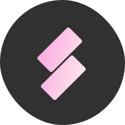

<br>

<p align="center">
  
</p>

<h1 align="center">Monolikit</h1>

<p align="center">
  <br />
  <a href="https://github.com/monolikit/monolikit/actions/workflows/test.yml"></a>
  <span>&nbsp;</span>
  <a href="https://github.com/monolikit/monolikit/releases"></a>
  <br />
  <br />
  <pre><div align="center">npm i -D monolikit</div></pre>
</p>


<div align="center">
  <br />
  A solution to develop server-driven, client-rendered applications.
  <br />
  Monolikit is an <a href="https://inertiajs.com">Inertia.js</a> fork which sole purpose is to try to push the developer experience to the maximum.
  <br />
  <b>Use at your own risk</b>.
  <br />
  <br />
  <br />
</div>

<br>

#   Features

All features of [Inertia.js](https://inertiajs.com), plus: 
- tight integration to Laravel, Vue and Vite
- written in TypeScript
- integration with [Laravel Data](https://github.com/spatie/laravel-data)
- integration with Vue Devtools
- a built-in router with typings
- a built-in permission helper with typings
- new concepts like nested `only`/`except` partial data and persistent data
- support for infinite scrolling
- ...among other things.

> **Warning** <br />
> SSR is not yet supported.

&nbsp;


# Installation

## On a fresh Laravel project

A preset is provided for an easy installation. You will need to have Node v16+ installed on your machine to use it.

```sh
npx @preset/cli apply laravel:monolikit
```

## On an existing project

First, install the adapters:

```sh
pnpm i monolikit
composer require monolikit/laravel
```

```ts
// vite.config.ts
import { defineConfig } from 'vite'
import monolikit from 'monolikit/vite'
import laravel from 'vite-plugin-laravel'
import vue from '@vitejs/plugin-vue'

export default defineConfig({
  plugins: [
    laravel(),
    monolikit({ /* options */ }),
    vue(),
  ]
})
```

&nbsp;

# Documentation

> TODO

&nbsp;

# Q&A

**What's the goal of this project?**
> Monolikit aims to provide the best possible developer experience when using Laravel, Vue and Vite. While its philosophy is not to stay as minimalist as Inertia, in order to keep up with the DX needs, it is not going to be bloated with too many features either.
<br/>

**When should I use Monolikit instead of Inertia?**
> If you're living on the edge and looking for a solution that tries to get rid of most of the paper cuts you'd otherwise encounter. If you're building something serious, maybe keep using Inertia.

&nbsp;

**Why fork Inertia instead of contributing?**
> The maintainers of Inertia are currently busy with other projects or burnt-out, and have a specific philosophy for the project that does not necessarily match mine.

&nbsp;

**Can I use Monolikit with other frameworks than Laravel or Vue?**
> The core of Monolikit is completely framework-agnostic, just like Inertia's. But there is no plan for an official adapter other than Laravel and Vue, in order to keep the maintenance simple. So you can, but you will have to build your own adapters.


<p align="center">
  <br />
  <br />
  ·
  <br />
  <br />
  <sub>Built with ❤︎ by <a href="https://github.com/enzoinnocenzi">Enzo Innocenzi</a>. <br/> Original credits go to <a href="https://reinink.ca">Jonathan Reinink</a>, the core team and the contributors.</sub>
</p>
