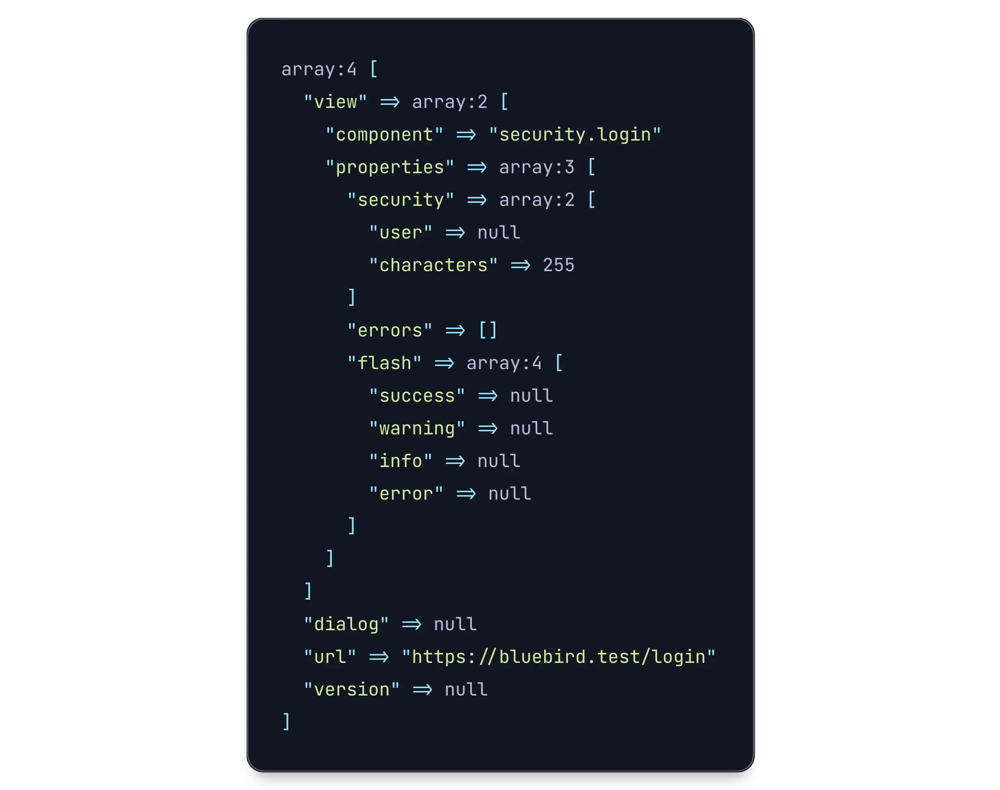
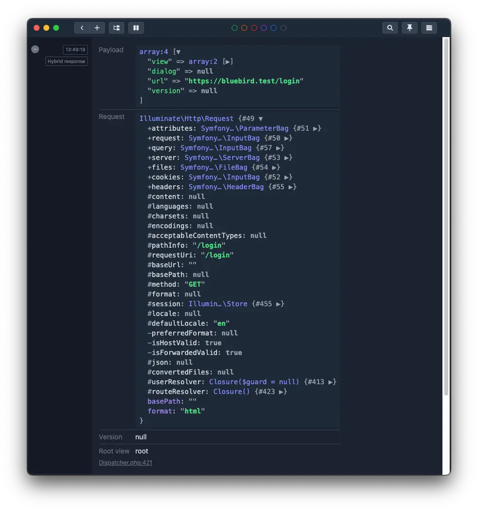

# Debugging

## Using Vue Devtools

Hybridly comes with a built-in Vue plugin that integrates with Vue Devtools. You may read more about it on the [dedicated documentation](./devtools.md).

## Using the console

Hybridly implements [debug](https://github.com/debug-js/debug), a lightweight debug utility that allows logging data.

To enable logging, you may add the `debug:*` key/value pair to your application's local storage. You may also be more specific and chose to only log certain values instead of using `*`.

## In tests

During tests, you may use the `hdd` macro on `TestResponse` instances.

```php
test('guests can see the login page', function () {
    get('/login')
        ->hdd()
        ->assertOk()
        ->assertHybrid();
});
```

When using `hdd` on non-hybrid responses, the response's body will be shown instead.



## Using Ray

If you are using [Ray](https://spatie.be/docs/ray/v1/introduction) by Spatie, the `showHybridRequests` macro will automatically be registered.

```php
ray()->showHybridRequests();
```

This may be useful, for instance, to investigate which properties are sent to the front-end.



To stop showing hybrid responses, you may also call `stopShowingHybridRequests`.
