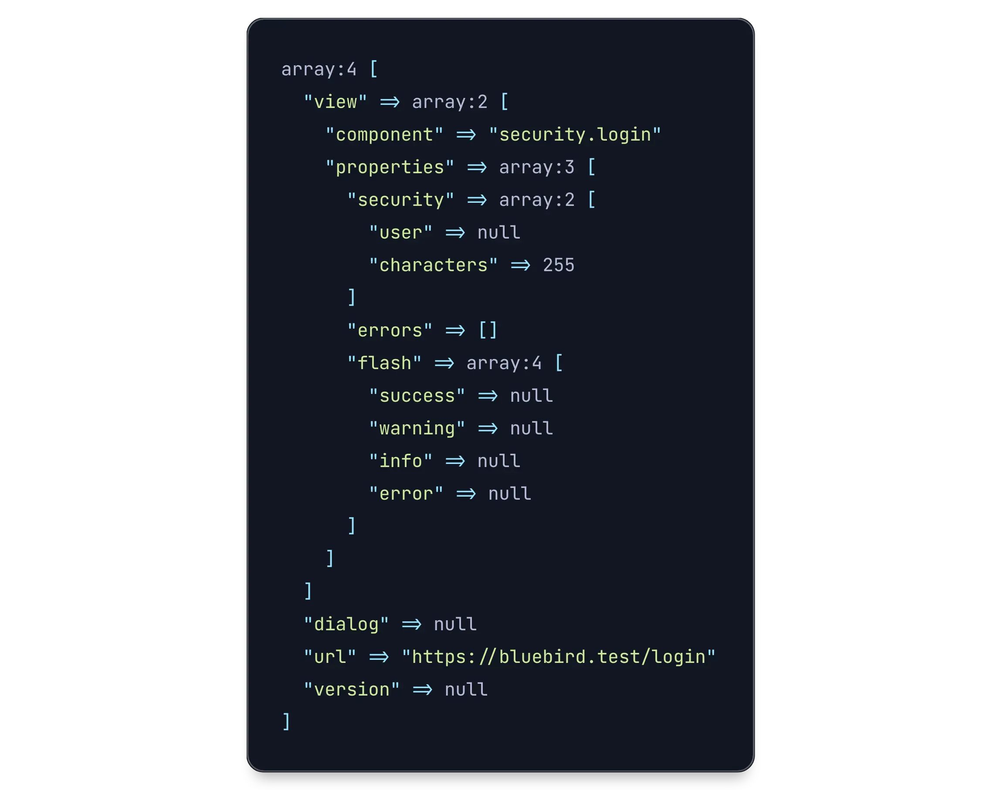

# Debugging

## Using Vue Devtools

The Vue plugin provided by Hybridly integrates with Vue DevTools. It makes debugging hybrid views convenient.

Make sure the [Vue DevTools](https://devtools.vuejs.org/) extension is installed in your browser, and open the Vue tab in the developer tools. Selecting any component will show a `hybridly` section with the active component name, properties, asset version, url and the routes registered by the router.

The Hybridly wrapper component shown below the root component displays the context, an object that contain the whole state of Hybridly's core.

## Using the console

Hybridly implements [debug](https://github.com/debug-js/debug), a lightweight debug utility that allows logging data.

To enable logging, you may add the `debug:*` key/value pair to your application's local storage. You may also be more specific and chose to only log certain values instead of using `*`.

## In tests

During tests, you may use the `hdd` macro on `TestResponse` instances.

```php
test('guests can see the login page', function () {
    get('/login')
        ->hdd()
        ->assertOk()
        ->assertHybrid();
});
```

When using `hdd` on non-hybrid responses, the response's body will be shown instead.


