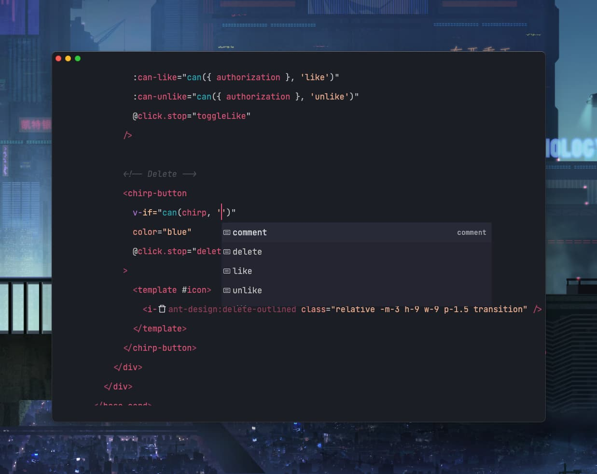
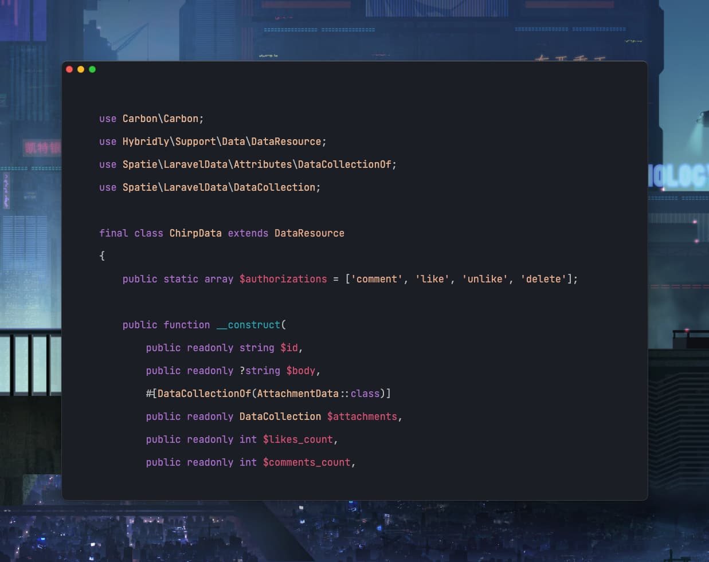
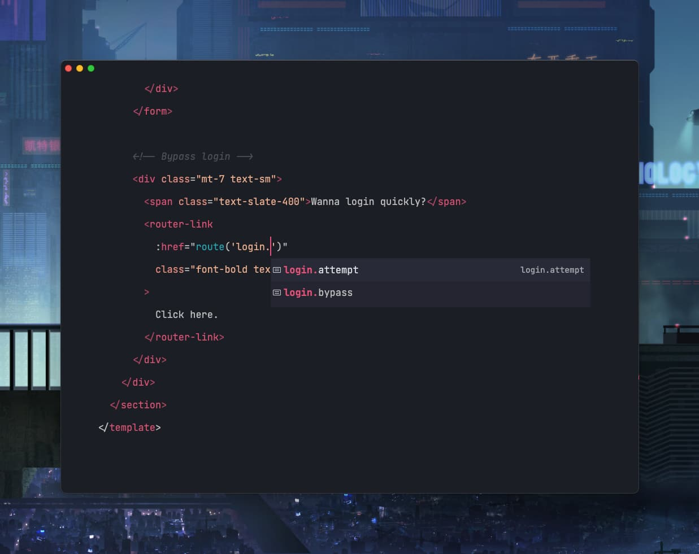

# Demonstration

## Overview

Blue Bird, a real-world application, showcases how to use Hybridly. 

It's a Twitter-like social network built with best practices in mind. [Data](https://github.com/spatie/laravel-data) and [TypeScript Transformer](https://github.com/spatie/laravel-typescript-transformer) are used to provide TypeScript definitions.

You can find the source code on [GitHub](https://github.com/hybridly/demo).

## Typed global properties

The following example shows how the `useProperty` function has auto-completion support for global properties defined in `HandleHybridRequests`.

## Typed `can` function

The following example shows how the `can` function has auto-completion support for defined authorizations.

## Typed `route` function

The following example shows how the `route` function has auto-completion support for named routed.

## Preview of Blue Bird

The following recording is a small preview of the features of Blue Bird. Examples of forms with validation, infinite scrolling, and file uploads are showcased.

<video controls class="mt-8 rounded-lg shadow-lg w-full">
   <source src="../assets/bluebird.webm" type="video/webm">
</video>
