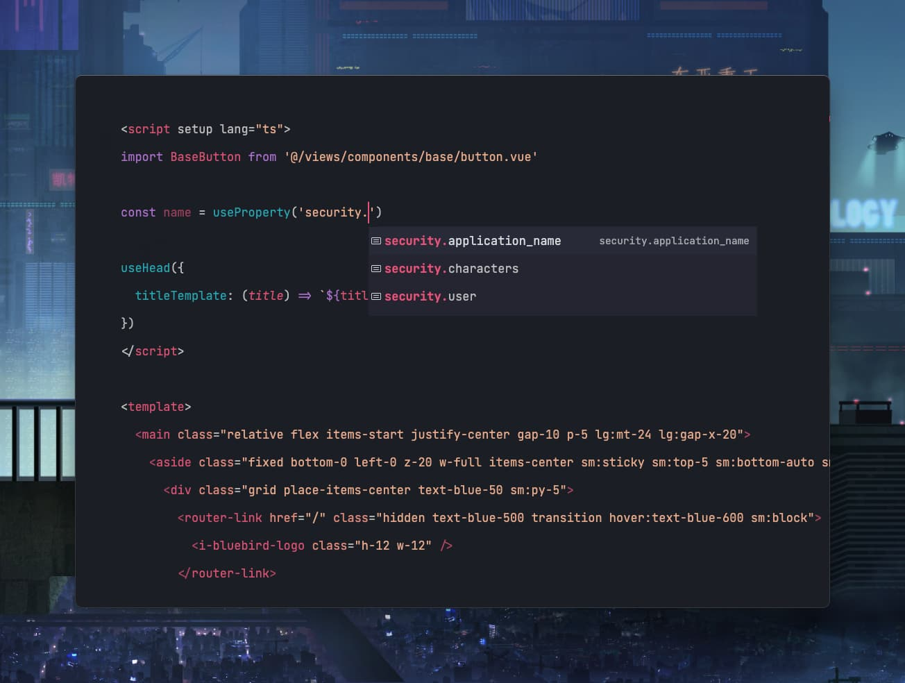

# Demonstration

## Overview

Blue Bird is an example application that showcases how to use Hybridly.

It's a Twitter mini-clone built in a way that should be familiar with Laravel developers. [`laravel-data`](https://github.com/spatie/laravel-data) and [TypeScript Transformer](https://github.com/spatie/laravel-typescript-transformer) are used to provide TypeScript definitions.

You can find the source code on [GitHub](https://github.com/hybridly/demo).

:::tip Hosted demonstration
A real-world application is being worked on and will replace Blue Bird. It will be a hosted, open-source web application built with best practices in mind.
:::

## Typed global properties

The following example shows how the `useProperty` function has auto-completion support for global properties defined in `HandleHybridRequests`.

## Typed `can` function

The following example shows how the `can` function has auto-completion support for defined authorizations.

## Typed `route` function

The following example shows how the `route` function has auto-completion support for named routed.

## Preview of Blue Bird

The following recording is a small preview of the features of Blue Bird. Examples of forms with validation, infinite scrolling, and file uploads are showcased.

<video controls class="mt-8 rounded-lg shadow-lg w-full">
   <source src="../assets/bluebird.webm" type="video/webm">
</video>

## Community projects

[PingCRM](https://github.com/inertiajs/pingcrm), Inertia's demonstration project, has been migrated to Hybridly by [Amine Ilidrissi](https://twitter.com/realaminevg). You may check out the repository [here](https://github.com/hybridly/pingcrm).

[Hybridly Laravel Breeze Scaffold](https://github.com/agednerd/hybridly-breeze-app), Laravel Breeze's base Vue scaffold has been migrated to Hybridly by [William Lepinski](https://github.com/wlepinski). You may check out the repository [here](https://github.com/agednerd/hybridly-breeze-app).
