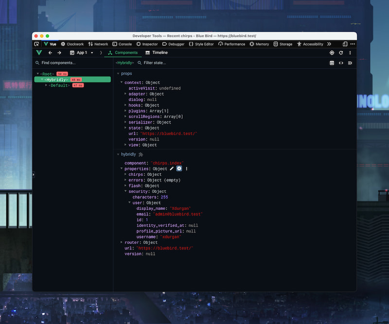

# Vue DevTools

## Overview

The Vue plugin provided by Hybridly integrates with Vue DevTools. It makes debugging hybrid pages convenient.

Make sure the [Vue DevTools](https://devtools.vuejs.org/) extension is installed in your browser, and open the Vue tab in the developer tools. Selecting any component will show a `hybridly` section with the active component name, properties, asset version, url and the routes registered by the router.

The Hybridly wrapper component shown below the root component displays the context, an object that contain the whole state of Hybridly's core.

