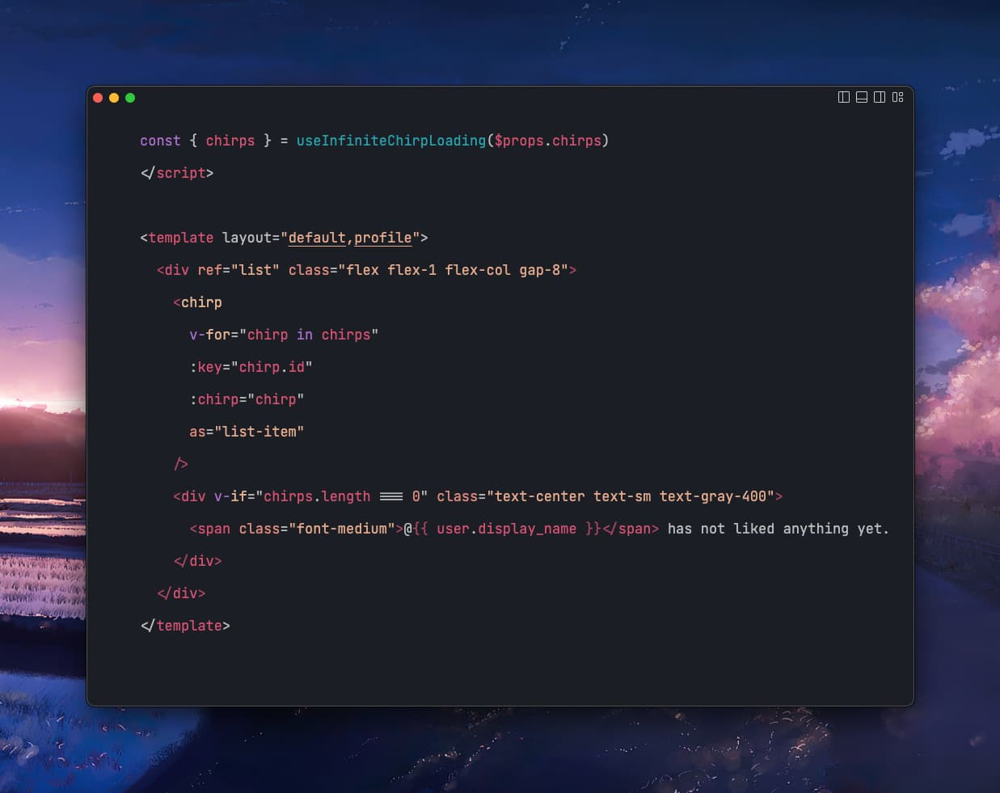
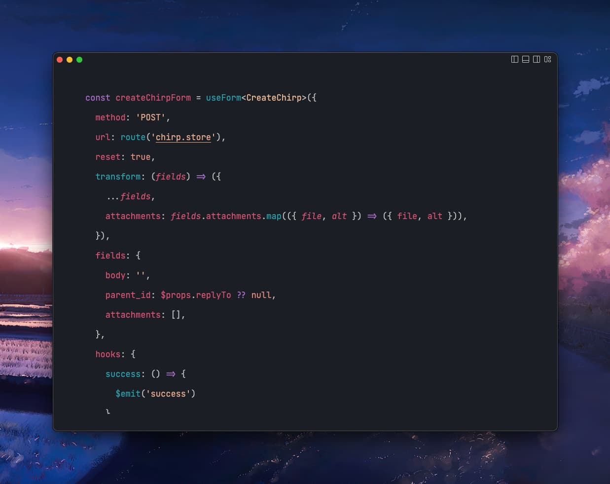
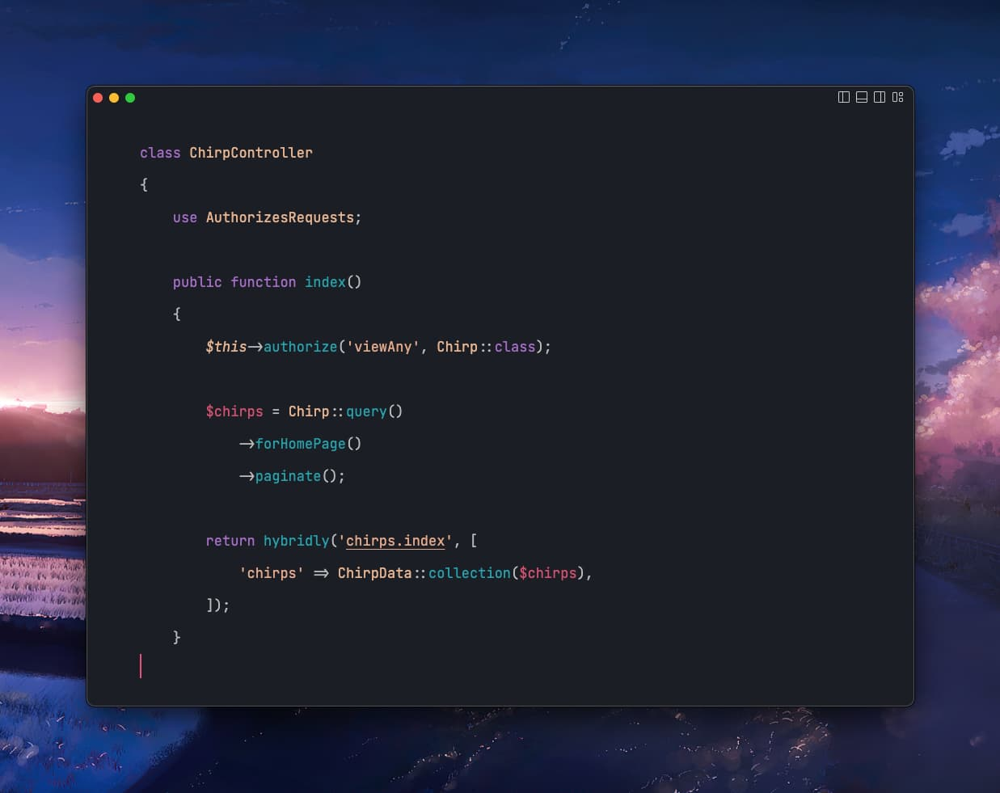

# Visual Studio Code

## Overview

The official [Visual Studio Code extension](https://marketplace.visualstudio.com/items?itemName=innocenzi.vscode-hybridly) offers an improved navigation support and auto-completion throughout Hybridly applications.

### Layout linking and auto-completion

When using the `<template layout>` syntax, the layout names will be linkified to their corresponding layout files.

### Route linking

When using Laravel or Hybridly's `route` functions, the route name will be linkified to its corresponding controller method.

### Component linking and auto-completion

When rendering a view with the `hybridly` function, the view component name will be linkified to its corresponding single-file component.

### Additionnal features

In addition to Hybridly-specific features, the Code extension also integrates with Pest, avoiding the need for the [Better Pest](https://github.com/m1guelpf/better-pest) extension, and adds support for scaffolding classes or updating namespaces.

By default, you may:
- Run the current test by pressing `F6`
- Run tests in the current file by pressing `F7`
- Run all tests by pressing `F8`
- Run the previous test by pressing `F9`
- Generate a class in an empty file by running the `Generate class` command
  - If the file is not empty, the command will update the namespace instead for quick refactoring
