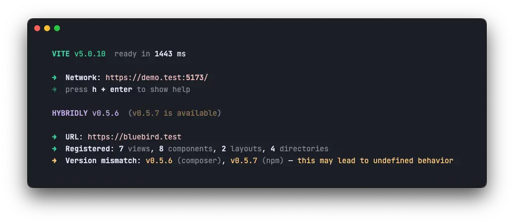
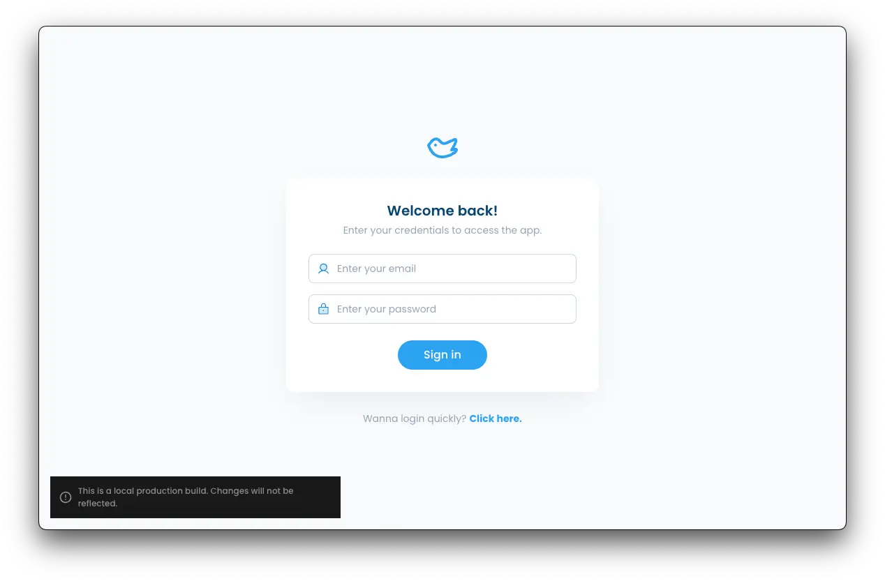

# Hybridly v0.6.0

<div class="preface">
Hybridly v0.6.0 implements Vite 5 support, improves its configuration and adds a few quality of life improvements.
</div>

## Upgrading

You may upgrade Hybridly using the following commands:

```shell [pnpm]
composer require "hybridly/laravel:^0.6.0"
pnpm i hybridly@^0.6.0
```

This release contains breaking change. Please follow the [upgrade guide](../guide/upgrade/0.6.x.md).

## The development server prompt is improved

The Laravel integration is now built-in instead of relying on the official `laravel/vite-plugin` package, which allows us to update the prompt to something more useful.



Additionally, opening the development server URL will now redirect to the actual application URL. In the example above, `https://demo.test:5173` redirects to `https://bluebird.test`.

## Local builds show a warning

Some people prefer working without the development server by default, starting it only when needed. In this situation, they have a local build of the application.

This is easy to forget and can lead to frustration when debugging why changes made to the front-end are not reflected, so this release introduces a warning when the application has been built with `APP_ENV` set to `local`.



Hovering the notification will lower its opacity, and clicking on it will close it. You may disable it completely by setting `warnOnLocalBuilds` to `false` in `vite.config.ts`.

## New `loadModule` architecture API

The architecture API has a [`loadModuleFrom`](../api/laravel/hybridly.md#loadmodulefrom) method that loads namespaced views, layouts and components from the specified directory.

Since modules were loaded from the same directory as where the method was called most of the time, this release adds a [`loadModule`](../api/laravel/hybridly.md#loadmodule) alternative that does just that.

## The `@vite` directive no longer needs the entrypoint path

The application entrypoint, `resources/application/main.ts` by default, is configurable in `config/hybridly.php`. It felt bad having to repeat it in multiple places, so Hybridly now overrides the `@vite` directive to automatically specify this path.

Specifying your own files in the directive and in `vite.config.ts` is still supported.

## Vite 5 is supported

Vite 5 is now supported. Their CommonJS API [has been deprecated](https://vitejs.dev/guide/troubleshooting.html#vite-cjs-node-api-deprecated), so it is now even more recommended to convert your project to ESM if it is not using it.

Vite 5 introduced a breaking change for back-end integrations: the `manifest.json` file moved to a `.vite` subdirectory. Hybridly reverts this change, but still supports the new location if you decide to move it back.

## Improved configuration

Internally, Hybridly has moved from `config()` calls to a singleton configuration object. This alone doesn't affect projects using it, but we took the opportunity to improve the configuration options, for clarity.

Most of this release's breaking changes come from this refactor. You may follow the [upgrade guide](../guide/upgrade/0.6.x.md) to see what changed.
